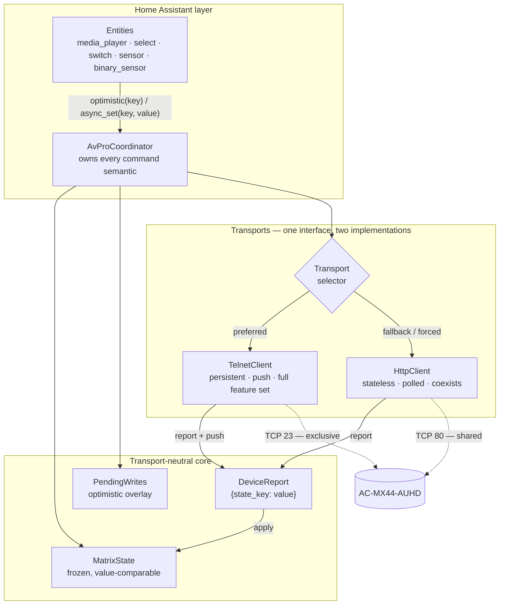

# System Design & Architecture

## Architecture Overview

**What is the high-level system structure?**

Four layers. The top two are transport-agnostic, which is the point: adding telnet must not mean
duplicating the state model, the entities, or the write semantics.



**Key components**

| Component | Responsibility |
|---|---|
| `avpro/report.py` | `DeviceReport` — a transport-neutral mapping of canonical state keys to values, plus merge semantics. The only thing a transport is allowed to produce |
| `avpro/state.py` | `MatrixState` and a single `apply(state, report)`. Replaces seven endpoint-shaped fold functions |
| `avpro/transport.py` | The interface both clients satisfy: `async_connect`, `async_read_all`, `async_command`, `subscribe` |
| `avpro/telnet/` | Line grammar and a persistent client that dispatches pushes |
| `avpro/http/` | The existing CGI protocol and stateless client, moved under a package |
| `coordinator.py` | Transport selection and fallback, the pending overlay, every command semantic |

## Data Models

**What data do we need to manage?**

**`DeviceReport`** — the seam that makes dual transport tractable.

```python
@dataclass(frozen=True, slots=True)
class DeviceReport:
    values: Mapping[str, Any]     # canonical state key -> value
    complete: bool                # a full census, or a partial push?
```

`complete` matters: a full report may clear fields it does not mention (the device has told us
everything), while a partial one must not. A telnet push carrying only `OUT1 VS IN2` must not
blank the other three routes.

Both transports normalise into the **same** vocabulary, so nothing downstream can tell them apart:

| State key | Telnet line | HTTP field |
|---|---|---|
| `video_route_1` | `OUT1 VS IN2` | `O1I2` in `VidSta` |
| `audio_route_1` | `OUT1 AS IN2` | `AO1I2` in `AudSta` |
| `extracted_audio_1` | `OUT1 EXA EN` | `O1AON` in `AudSta` |
| `audio_delay_1` | `OUT1 EXADL PH3` | `O1D3` in `AudSta` |
| `scaler_1` | `OUT1 VIDEO 2` | `O1V2` in `SysSta` |
| `image_enhancement_1` | `OUT1 IMAGE ENH 1` | `O1E1` in `SysSta` |
| `test_pattern_1` | `OUT1 SGM EN` | `O1SGMON` in `SysSta` |
| `bind_mode` | `EXAMX MODE2` | `AMB2` in `AudSta` |
| `edid_1` | `IN1 EDID 30` | `EDIDU1` in `EdidSta` |
| `stream_1` | `OUT1 STREAM ON` | **unavailable** |
| `input_power_1` | `IN1 TMDS ON` | **unavailable** |
| `key_lock` | `KEY LOCK OFF` | **unavailable** |
| `lcd_timeout` | `LCD ON T2` | **unavailable** |

Note the EDID row: telnet says `30`, HTTP says `EDIDU1`, and both normalise to the option key
`user_1`. The two vocabularies were independently confirmed to describe the same 33 presets, so
this is a mapping rather than a guess.

## API Design

**How do components communicate?**

```python
class Transport(Protocol):
    """What the coordinator may assume, regardless of which wire is in use."""

    capabilities: TransportCapabilities   # what this wire can read and write

    async def async_connect(self) -> None: ...
    async def async_disconnect(self) -> None: ...
    async def async_read_all(self) -> DeviceReport: ...          # full census
    async def async_command(self, key: str, value: Any) -> None: ...
    def subscribe(self, on_report: Callable[[DeviceReport], None]) -> Callable[[], None]: ...

    @property
    def pushes(self) -> bool: ...   # True for telnet, False for HTTP
```

`subscribe` exists on both. The HTTP client simply never calls back, so the coordinator does not
branch on transport type — it polls when `pushes` is False and treats a push as an early poll
result when it is True.

## Component Breakdown

**What are the major building blocks?**

### 1. Telnet client

A persistent connection, because that is the only way to receive pushes.

- **Framing.** Line-oriented, `\r\n`-terminated. Commands need a trailing return.
- **Responses and pushes share one stream** (C6). There is no request/response correlation in the
  protocol, so the client does not attempt one: every inbound line is fed to the same parser and
  merged into a report. A command is "confirmed" by the value arriving, exactly as over HTTP.
  This is why the write model needs no change.
- **Census via `GET STA`** — one command returns the whole device (R18), so setup is a single
  round trip rather than six.
- **Per-index GETs only.** The documented `0 = ALL` form returns nothing (C7), so it is never
  used; `GET STA` covers the "everything" case anyway.
- **Reconnect** with jittered backoff from a per-entry `random.Random`. On disconnect the pending
  overlay is dropped — a replayed optimistic value is a stale claim.
- **Idle.** The socket survived 40 s untouched (C5) and the device volunteers a routing dump every
  8–16 s (C4), so no keepalive is sent. A watchdog treats a long silence as a dead connection.

### 2. Transport selection and fallback

| Setting | Behaviour |
|---|---|
| `auto` (default) | Try telnet. If the socket is busy or the connection fails, fall back to HTTP and retry telnet every 5 minutes. Log the fallback once |
| `telnet` | Telnet only. If unavailable, the entry is not ready — do not silently degrade |
| `http` | **Never open port 23.** Honours S8 absolutely |

Under `http`, telnet-only entities (stream, input power, key lock, LCD timeout) are not created.
Capability drives entity creation, exactly as an absent HTTP endpoint already does — so the
existing mechanism extends rather than being replaced.

### 3. What this deletes

Subtract before adding:

- The seven `fold_*` functions in `state.py` collapse to one `apply(state, report)`. They exist
  only because the HTTP endpoints have different shapes; once a transport normalises to a report,
  the distinction is the transport's problem.
- `PollSchedule`'s tiering becomes dead weight on telnet, where one command reads everything and
  pushes cover the rest. It stays for the HTTP path only.

### 4. Unchanged

The pending overlay, the confirm-by-value rule, the "never re-send" invariant, the change-gated
entity writes and the entity inventory are all transport-agnostic and need no modification. That
is the evidence the seam is in the right place.

## Design Decisions

**Why did we choose this approach?**

| Decision | Rationale |
|---|---|
| Telnet preferred, HTTP fallback | Telnet is strictly more capable (R12–R15, R17, R18) and the socket is currently free (C2). HTTP remains as the coexistence path |
| `DeviceReport` as the seam | Without it, telnet support means a second state model or transport types leaking into entities. With it, the HA layer is untouched |
| No request/response correlation | The protocol offers none, and confirm-by-value already works. Inventing correlation would be a shallow layer over something that does not need it |
| `iot_class: local_push` | Honest for the default configuration. HTTP fallback degrades to polling, which the docs state |
| Keep polling even on telnet | A `GET STA` every 60 s costs nothing and catches a missed push. Push is an optimisation over correctness, not a replacement for it |
| Transport is an option, not auto-only | S8. A user with another control system must be able to say "never take that socket" and be obeyed |
| Retain the HTTP transport | Deleting it would remove R19 (rename) and the only way to coexist |

**Alternatives considered and rejected**

- **Telnet only.** Simplest and most capable, but Home Assistant would permanently own the sole
  control socket. Rejected because it makes an irreversible-feeling choice on the user's behalf.
- **HTTP only (the current implementation).** Coexists perfectly, but forgoes six requirements and
  polls a device that is willing to push. Rejected now that C2 shows the constraint that justified
  it does not currently hold.
- **Telnet for reads, HTTP for writes.** Superficially attractive — the reader keeps the socket,
  the writer coexists. Rejected: it holds the exclusive socket anyway, so it pays the whole cost
  of telnet while giving up its most useful half.
- **A second config entry per transport.** Rejected: two entries for one device duplicates every
  entity and makes the device registry lie.

## Non-Functional Requirements

**How should the system perform?**

| Concern | Target | Approach |
|---|---|---|
| Change latency | < 2 s (S2) | Telnet push measured at 300–400 ms; HTTP fallback polls at 5 s |
| Entity churn | Zero writes when nothing changed (S4) | Value-comparable state, `always_update=False`, per-entity snapshot comparison |
| Device load | Well under what the unit tolerates | Telnet: one persistent socket, one `GET STA` per minute. HTTP: 0.45 req/s tiered, against a unit that served 10 req/s cleanly |
| Coexistence | Never hold port 23 when told not to (S8) | Enforced by transport setting; a test asserts no connection is attempted under `http` |
| Recovery | No restart needed | Jittered reconnect backoff, one log line per outage |
| Site data | None in the repository (S7) | Index-based entity names, redacted diagnostics, an enumerating audit test |

## Security Notes

The device has no authentication of any kind — no credentials, no TLS, on either transport. There
is nothing to store and nothing to re-authenticate, which is why `reauthentication-flow` is exempt.

What needs protecting is not access but **topology**: which rooms exist and what is plugged into
each input. Both transports return that on every full read. It stays out of the repository, out of
diagnostics, and out of entity ids.

Network-configuration commands are unreachable by construction on both transports, including
through the raw-command escape hatch. A wrong address on a matrix in a wiring closet is a site
visit, and no automation should be able to cause one.
